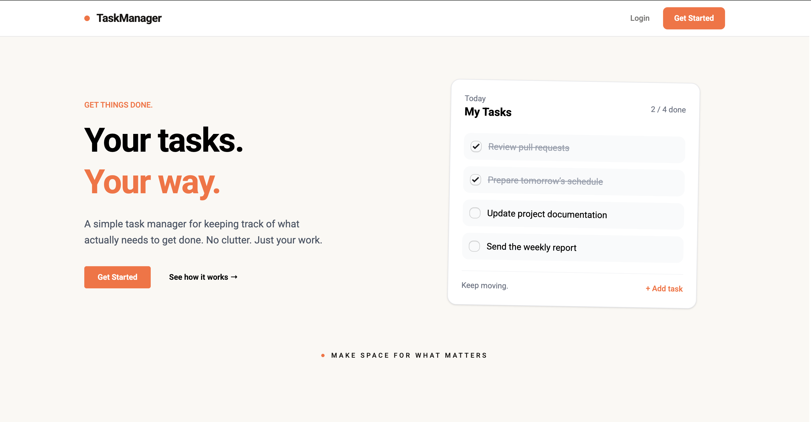
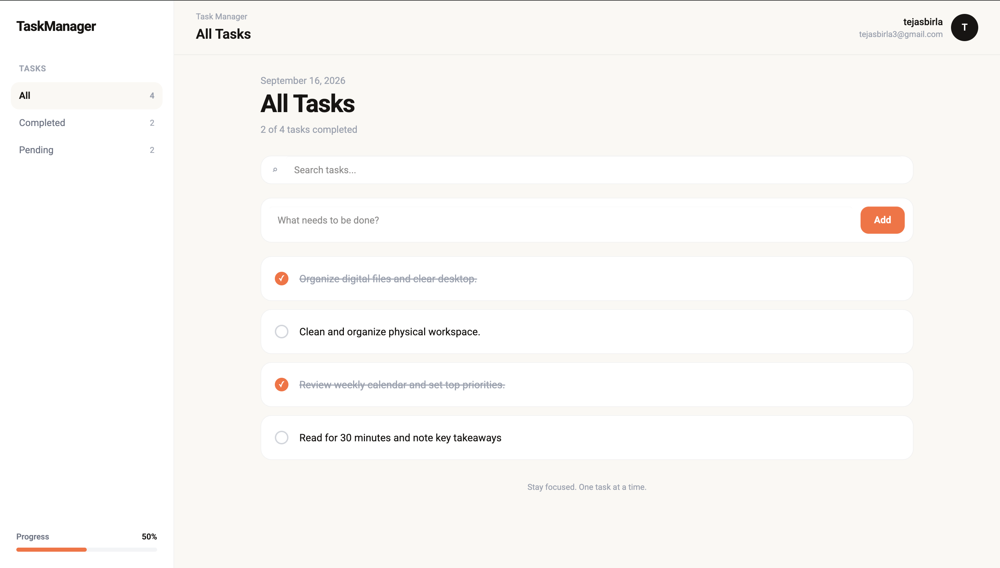
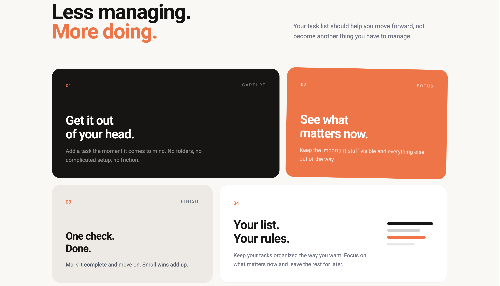

# TaskManager

A full-stack task management application built to practice building a real-world REST API with Flask, PostgreSQL, JWT authentication, and a React frontend.

The project focuses on backend development, API design, authentication, database operations, and connecting a React frontend to a Flask REST API.

---

## Features

* User registration and login
* Password hashing
* JWT-based authentication
* Protected API routes
* User-specific tasks
* Create, read, update, and delete tasks
* Mark tasks as completed or pending
* Duplicate task validation
* Input validation
* PostgreSQL database
* React frontend
* Axios API integration
* JWT token automatically attached to API requests
* Context API for global authentication and task state
* Protected frontend routes
* Search tasks
* Filter tasks by status
* Toast notifications
* Logout functionality

---

## Screenshots

### Hero Section



### Dashboard



### Why Choose Us



---

## Tech Stack

### Frontend

* React
* React Router
* Context API
* Axios
* Tailwind CSS
* React Hot Toast
* React Icons
* Vite

### Backend

* Python
* Flask
* Flask Blueprints
* REST API
* psycopg
* PostgreSQL
* JWT
* Password hashing

---

## Project Structure

```text
flask-task-manager/
│
├── .gitignore
├── README.md
│
├── screenshots/
│   ├── dashboard.png
│   ├── hero.png
│   └── whyChooseUs.png
│
├── client/
│   ├── src/
│   │   ├── components/
│   │   ├── context/
│   │   │   ├── AuthContext.jsx
│   │   │   ├── AuthProvider.jsx
│   │   │   ├── TaskContext.jsx
│   │   │   └── TaskProvider.jsx
│   │   ├── pages/
│   │   ├── services/
│   │   │   └── api.js
│   │   └── App.jsx
│   │
│   └── package.json
│
└── server/
    ├── app.py
    ├── db.py
    ├── routes/
    ├── validators.py
    ├── token_utils.py
    ├── auth_middleware.py
    ├── .env
    └── requirements.txt
```

> The `.env` file is kept locally and is not committed to GitHub.

---

## Authentication Flow

TaskManager uses JWT authentication.

When a user registers or logs in:

```text
React
  ↓
POST /api/login
  ↓
Flask
  ↓
Validate credentials
  ↓
Generate JWT
  ↓
Return token + user
  ↓
React stores token
```

For protected requests, Axios automatically adds the JWT token:

```text
Authorization: Bearer <token>
```

The Flask authentication middleware verifies the token before allowing access to protected routes.

Each task is associated with the authenticated user, which allows the API to enforce task ownership.

---

## API Endpoints

### Authentication

| Method | Endpoint           | Description         | Auth |
| ------ | ------------------ | ------------------- | ---- |
| POST   | `/api/register`    | Register a new user | No   |
| POST   | `/api/login`       | Login user          | No   |
| DELETE | `/api/delete/user` | Delete current user | Yes  |

### Tasks

| Method | Endpoint                | Description              | Auth |
| ------ | ----------------------- | ------------------------ | ---- |
| GET    | `/api/all-tasks`        | Get current user's tasks | Yes  |
| POST   | `/api/add-task`         | Create a task            | Yes  |
| GET    | `/api/task/<id>`        | Get a single task        | Yes  |
| PUT    | `/api/task/<id>`        | Update a task            | Yes  |
| DELETE | `/api/delete/task/<id>` | Delete a task            | Yes  |

---

## Example Requests

### Register

```json
{
  "username": "tejas",
  "email": "tejas@example.com",
  "password": "password123"
}
```

### Login

```json
{
  "username": "tejas",
  "password": "password123"
}
```

### Add Task

```json
{
  "task_desc": "Finish the project"
}
```

### Update Task

```json
{
  "task_desc": "Finish the Flask project",
  "completed": true
}
```

---

## Database

PostgreSQL is used for persistent data storage.

The application uses a relational database structure where users can have multiple tasks.

### Users

The users table stores authentication and account information such as:

```text
user_id
username
email
password
```

### Tasks

The tasks table stores:

```text
task_id
task_desc
completed
user_id
```

Each task is associated with the user who created it through `user_id`.

This allows the API to ensure that users can only retrieve, update, or delete their own tasks.

```text
users
  │
  │ user_id
  │
  └──────────< tasks
                 │
                 └── user_id
```

---

## Environment Variables

Create a `.env` file inside the `server` directory:

```env
JWT_SECRET_KEY=your_secret_key
```

Do not commit `.env` to GitHub.

The `.env` file should be included in `.gitignore`.

For production deployment, environment variables should be configured directly through the hosting platform instead of committing them to the repository.

---

## Backend Setup

Navigate to the server directory:

```bash
cd server
```

Create a virtual environment:

```bash
python3 -m venv venv
```

Activate it:

### macOS / Linux

```bash
source venv/bin/activate
```

Install the required dependencies:

```bash
pip install -r requirements.txt
```

Make sure PostgreSQL is running and the required database is available.

Then start Flask:

```bash
python app.py
```

The backend will run locally on:

```text
http://127.0.0.1:5000
```

---

## Frontend Setup

Navigate to the client directory:

```bash
cd client
```

Install dependencies:

```bash
npm install
```

Start the development server:

```bash
npm run dev
```

The React application will then be available through the Vite development server.

---

## Frontend Architecture

The frontend uses React Context API to manage global application state.

### AuthContext

Responsible for:

* Current user
* Login
* Registration
* Logout
* Authentication loading state

### TaskContext

Responsible for:

* Fetching tasks
* Adding tasks
* Updating tasks
* Deleting tasks
* Updating task state

### Axios Instance

A centralized Axios instance is used for API communication.

The request interceptor automatically reads the JWT token from `localStorage` and attaches it to protected requests.

```text
React Component
      ↓
Context Controller
      ↓
Axios
      ↓
Flask REST API
```

---

## Backend Architecture

The backend is organized around Flask Blueprints and separates different responsibilities.

```text
Request
   ↓
Flask Route
   ↓
JWT Middleware
   ↓
Validation
   ↓
PostgreSQL
   ↓
JSON Response
```

This structure keeps authentication, validation, database operations, and routes separated and easier to maintain.

---

## Error Handling

The API validates incoming data before performing database operations.

Examples include:

* Missing request body
* Missing required fields
* Empty task descriptions
* Invalid email addresses
* Short passwords
* Invalid login credentials
* Duplicate usernames/emails
* Duplicate tasks
* Unauthorized requests
* Requests for tasks that do not belong to the current user

HTTP status codes are used to communicate the result of each request.

---

## Security

The project implements several basic security practices:

* Passwords are hashed before being stored
* JWT authentication is used for protected routes
* Protected endpoints require a valid JWT
* Users can only access their own tasks
* Environment secrets are stored in `.env`
* `.env` is excluded from Git
* User ownership is checked during task operations

---

## What I Learned

This project was built as a hands-on way to understand how a React frontend communicates with a Python backend and database.

Key concepts practiced:

* Flask REST APIs
* Flask Blueprints
* PostgreSQL
* SQL queries
* psycopg
* CRUD operations
* Request validation
* Exception handling
* Password hashing
* JWT authentication
* Middleware
* Authorization
* React Context API
* Axios interceptors
* Protected routes
* State management
* Connecting React with a REST API
* Frontend and backend communication
* User-specific database operations

---

## Future Improvements

Possible improvements for a future version:

* Persistent authentication after page refresh
* JWT refresh tokens
* Better database connection management
* Automated tests
* API documentation
* Production configuration
* Additional task management features

---

## Purpose

This project was created primarily as a learning project to understand how a modern full-stack application works from the frontend to the database.

The main goal was not to build a complex task management platform, but to understand the fundamentals of building and connecting a React frontend with a Flask REST API and PostgreSQL database.

---

## License

This project is for learning and educational purposes.
